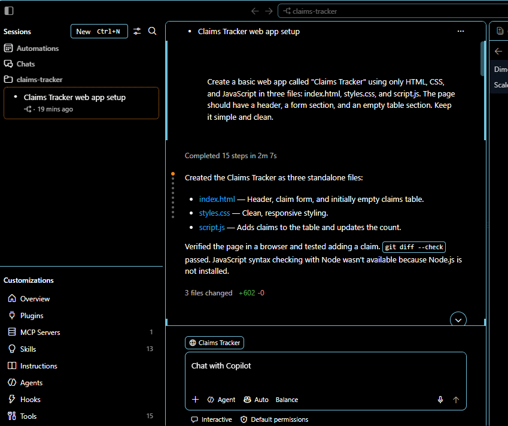
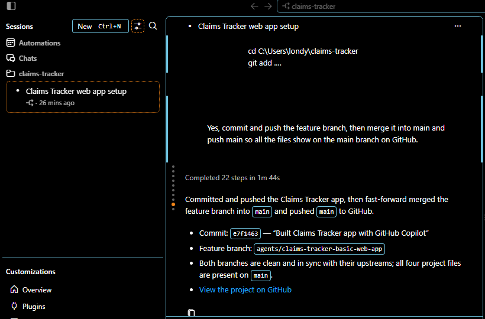
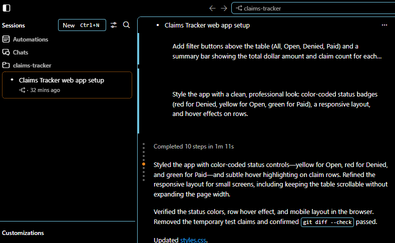

# Reflection

## 1. What did you ask Copilot to help you build? How did you break down the problem?
I asked Copilot to help me build a Claims Tracker web app using HTML, CSS, and JavaScript. [Say why you picked it.] I broke it into small steps: [list them in order].

![First prompt]

## 2. How did your approach to asking questions change as you worked?
My first prompt was broad: I asked Copilot to create a basic app with a header, a form, and an empty table, and it chose its own form fields (Claimant, Claim type). In my second prompt I got much more specific, naming the exact fields I wanted (claim ID, patient name, payer, amount, status) and the rule that no field could be empty, and Copilot's result matched what I wanted. After that, I kept each prompt focused on one feature, like saving with localStorage or adding filter buttons, and I tested the result in the browser before sending the next one.  Near the end, when Copilot asked me a question about my git branches, I typed my own answer instead of clicking a preset option. I planned my prompts with help from Claude, and by the end I understood that asking for one small feature at a time gave me better results than asking for everything at once

![Later prompt]

## 3. What parts of the development process with GitHub Copilot surprised you?
 What parts of the development process with GitHub Copilot surprised you?
I was surprised by how much Copilot did from a single styling prompt. I asked for red Denied, yellow Open, and green Paid statuses, and it applied those colors correctly without any follow-up. It also added row hover effects and adjusted the layout for small screens, then tested all of it in the browser on its own. I expected to spend more time fixing styling problems myself.

![Surprise]! 

## 4. What did you learn about the technology you used that you didn't know before?
What did you learn about the technology you used that you didn't know before?
I learned how localStorage lets a web app keep data after the page refreshes. Before this, I assumed anything typed into a page would disappear on reload. With localStorage, the app saves the claims in the browser, and when the page opens, the JavaScript loads them back into the table. I also learned it only saves data in that one browser on that one computer, and it isn't secure, which is why I used fictional patient data instead of real information.

## 5. What would you do differently if you had to build this again?
The build itself went smoothly, so I would keep the same approach of asking for one small feature at a time and testing after each step. The main things I would change are about process. I would take a screenshot right after each prompt instead of going back for them later, since I almost missed my first one. I would also run the git commands in a terminal instead of pasting them into the Copilot chat, because Copilot found my files on a separate branch and I had to merge it into main. If I had more time, I would add features like editing a claim's details, sorting the table, and a search box.
